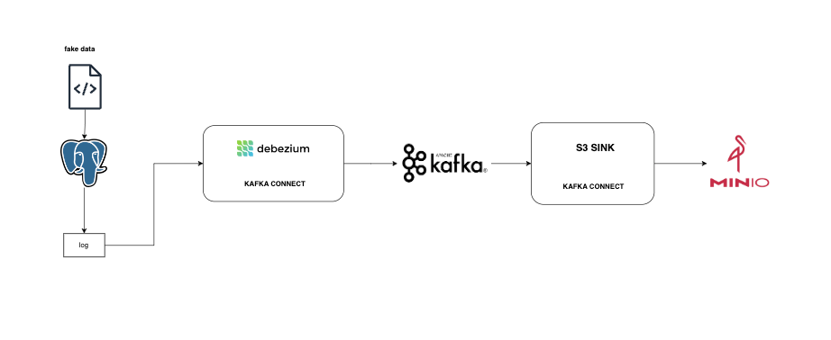

# Change Data Capture (Project) - Debezium and Kafka Connect
### Overview
This project is a demonstration of Change Data Capture (CDC) using Debezium to capture changes from PostgreSQL through Kafka Connect and store them in S3.
### Architecture of demo

### Structure of source:
#### src (Source Code)
- **connectors**
  - `pg-src-connectors.json`
  - `s3-sink.json`
- **container**
  - **connect**
    - `Dockerfile`
  - **dategen**
    - `Dockerfile`
  - **postgres**
    - `Dockerfile`
    - `init.sql`
  - **datagen**
    - `gen_user_payment_data.py`
- `Makefile`
- `docker-compose.yml`
- `README.md`
### How to start?
clone repository
```bash
git clone git@github.com:quocde99/change_data_capture.git
```
start docker compose
```bash
make up
```
create connector kafka connect:
- connect from source to kafka connect(file config): pg-src-connectors.json
- connect from kafka to sink S3(file config): s3-sink.json
```bash
make connectors
```
Result

[MinIo](http://localhost:9000/)  

[Debezium UI](http://localhost:8080/)

[Kafdrop](http://localhost:9050/)

down docker compose
```bash
make down
```
